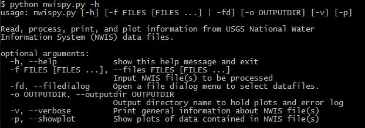

nwispy
======

Version
-------
1.0.0

DESCRIPTION
-----------
*nwispy* is a command line tool for analysing U.S. Geological Survey (USGS) water resource data 
collected nationwide on rivers and streams by USGS gages and instruments. The National Water
Information System (NWIS) is the Nation's principal repository of water resources data.  Most NWIS
data can be accessed directly at:

http://waterdata.usgs.gov/nwis/

and for real-time data for surface water, ground water, or water-quality data:

http://waterdata.usgs.gov/nwis/rt

*nwispy* can read, process, plot, and print data and information from NWIS daily, instantaneous (real-time), 
and/or site data files. The NWIS data files can come from any USGS site nationwide and can contain any
number of parameters (discharge, gage height, temperature, precipitation, sediment concentration, 
turbidity, depth to water level, etc.).  Time-series plots are automatically created and saved for all 
parameters displaying relevant statistics (mean, maximum, and minimum) with detailed axes and title descriptions.  

*nwispy* is written in Python and has been built to be a "Unix friendly" tool, meaning it can be placed anywhere 
along a Unix pipeline (see General Instructions). *nwispy* has a help menu that lists the current command line 
arguments/options that can be passed to *nwispy*. To use *nwispy*, users will use a shell to execute *nwispy*
with the appropriate flags to process files stored on the user's machine. To be implemented soon is a web service
to NWIS. Please see *IN THE WORKS**. The command line interface is shown below. 

*nwispy* command line interface
-------------------------------

Sample output images
--------------------

GENERAL INSTRUCTIONS
--------------------

To use *nwispy*, users will use a shell to execute *nwispy* with the appropriate flags to process files 
stored on the user's machine. To be implemented soon is a web service to NWIS. Please see *IN THE WORKS**.
Plots are automatically generated and saved to an directory named *output-filename*.  An error log called
*error.log* that logs any errors found in the data file, such as missing data values, is automatically 
generated and saved to the same directory that the plots are saved in.

**Help -h flag**

The -h flag spawns a help menu with all the flag options.

**File(s) -f flag**

The -f flag specifies a file or files to process.

To process a single NWIS data file the general syntax is:

	$ python nwispy.py -f path/to/file
	
The above commands will create an output directory with the following contents:

	output-filename/
					error.log	# logs any errors found in data file, such as missing data values
					*.png		# plots of each parameter in the data file
					...
					*.png
	
For example, using data contained in this repository's data directory:

	$ python nwispy.py -f ../data/datafiles/03290500_dv.txt
	
will produce the following output directory: 

	output-03290500_dv.txt/
					error.log	
					USGS 03290500 KENTUCKY RIVER AT LOCK 2 AT LOCKPORT, KY - Discharge, cubic feet per second (MEAN).png		

To process a multiple NWIS data files the general syntax is:

	$ python nwispy.py -f file1 file2 file3

**File Dialog -fd flag**

The -fd flag spawns a file dialog box for users to choose files: 

	$ python nwispy.py -fd
	
The above commands will create an output directory in the same manner as the -f flag.

**Plot -p flag**

The -p flag shows plots to the screen for the user to analyse and query. 

	$ python nwispy.py -fd -p
OR

	$ python nwispy.py -f file.txt -p
	
The above commands will create an output directory in the same manner as the -f flag.

**Verbose -v flag**

The -v flag prints data file information, such as the type of parameters found, to the screen for the user. 

	$ python nwispy.py -f file.txt -v
	
The above commands will create an output directory in the same manner as the -f flag.

**Output directory -o flag**

The -o flag is used to allow users to name the root of the output directory.  By default the output root name is *output*. 

	$ python nwispy.py -f file.txt my_output_dirname
	
The above commands will create an output directory in the same manner as the -f flag.

**Unix Friendly**

Users can place *nwispy* along a Unix pipeline.  For example, *nwispy* can accept standard input.

	$ cat file.txt | nwispy.py 

OR

	$ cat file.txt | nwispy.py -p -v 

	OR

	$ cat file.txt | nwispy.py -o my_output_dirname
	
By default, the output directory name created is *output* when using standard input, unless users specify the -o flag
to name the output directory.

For code documentation, please visit:

http://ky.water.usgs.gov/usgs/projects/jlant_program_code/nwispy/html/index.html
	
REQUIREMENTS
------------
Please see REQUIREMENTS.txt
	
INSTALLATION INSTRUCTIONS
-------------------------

REPOSITORY LAYOUT
-----------------

	bin/						# directory containing executables
	data/						# directory containing sample data files to use with software and associated information
		datafiles/				# directory containing sample data to use with software
			...
		README.txt				# file describing sample data in datafiles/
	docs/						# directory containing code documentation
		...
		html/					# html code documentation
		...
	images/						# directory with sample images and screenshots
		...
	nwispy/						# directory containing code modules
		nwispy.py				# main controller
		nwispy_views.py			# module that handles views; plotting and printing
		nwispy_filereader.py	# module that handles file reading and processing
		nwispy_helpers.py		# module that contains helper functions
		nwispy_webservice.py	# module that contains web service capabilities
		...
	tests/						# directory containing unit tests using nose library (https://nose.readthedocs.org/en/latest/)
		...
	Makefile					# makefile to help clean directories
		LICENSE.txt				# USGS Software User Rights Notice
	README.md					# README file
	REQUIREMENTS.txt			# list of requirements/dependencies 
	setup.py					# code for building, distributing, and installing modules
	
AUTHOR
------

	Jeremiah Lant
	Hydrologist 
	U.S. Geological Survey
	Kentucky Water Science Center
	Louisville, Kentucky 40299
	(502) 493-1949
	jlant@ugs.gov

IN THE WORKS
------------

* Web service capability to automatically get NWIS data files based on a user request file. 

* Improvement to the *nwispygui.py* code to allow users to interact with plots using a 
*SpanSelector* mouse widget. A key press of 'A' or 'a' would active the slider and a key press of 
'Q' or 'q' de-activates the slider.
	
DISCLAIMER and NOTICE
---------------------

	Please refer to the USGS Software User Rights Notice (LICENSE.txt or http://water.usgs.gov/software/help/notice/)
	for complete use, copyright, and distribution information. The USGS provides no warranty, expressed or implied, as to the
	correctness of the furnished software or the suitability for any purpose. The software has been tested, but as with any
	complex software, there could be undetected errors. Users who find errors are requested to report them to the USGS.

	References to non-USGS products, trade names, and (or) services are provided for information purposes only and do not
	constitute endorsement or warranty, express or implied, by the USGS, U.S. Department of Interior, or U.S. Government, as to
	their suitability, content, usefulness, functioning, completeness, or accuracy.

	Although this program has been used by the USGS, no warranty, expressed or implied, is made by the USGS or the United
	States Government as to the accuracy and functioning of the program and related program material nor shall the fact of
	distribution constitute any such warranty, and no responsibility is assumed by the USGS in connection therewith.

